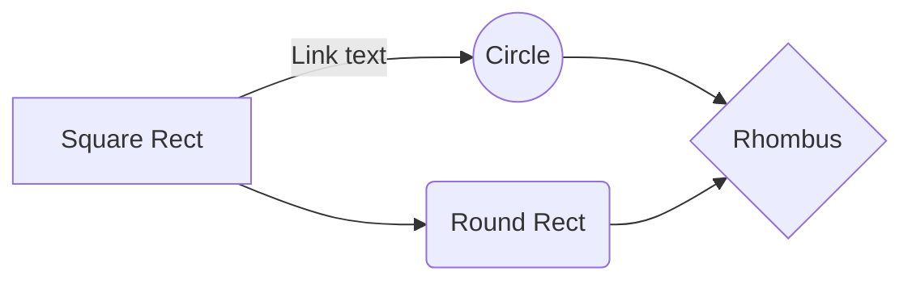

# Welcome to InPrompts as a Modular Monolith

### Tech stack bullet list
* Domain Driven Design - Entities with well defined root aggregates and separation.
* Clean Architecture - Domain/Application/Infrastructure with subcategory isolation.
*  Entity Framework Core 8 - Including fluent builder for more explicit context and migration.
* Microsoft Identity - Auth bearer implementation.
* Docker - Compose for easy database creation and management.
* Postgres - Containerized and part of our docker compose up
* Minimal Web API - Using Fast-Endpoints with the _REPR_ (Request-Endpoint-Response) pattern.
* MediatR - Command query responsibility segregation _(CQRS)_ pattern with in-process debugging!
* RabbitMQ - Event bus for cross module complexities and aux functionality (email on publish)
* Xunit - TESTING TESTING TESING
* FluentAssestions - Did I mention TESTING?
* Angular 18 - Signals, Standalone Components: The latest from Angular, all the goodies of the latest Angular. I find this important because Angular is positioning to decouple from RXJS and ZoneJS

# The Back End
My application implements the latest design paradigms and architectural best practices from Microsoft. The modular monolith takes advantage of tenants that fall in the "Pros" section of both Microservices and Monoliths and leaves the fray with as few "Cons" as possible from developing an application that adheres to one exclusive architecture. I've become a huge fan of the Modular Monolith, it struck me profoundly due to it's capacity to solve the design paralysis that can come with starting a new project. The Modular Monolith positions developer so that we are well situated to refactor portions of the app into Microservice architecture with no tight coupling. We could, for example; Refactor our User entity and Identity module into its own Microservice to take on a large user ingress with horizontal deployment scaling on Azure, without having to overhaul or navigate too far from the the style and architecture of our application. A developer at any skill level becomes most capable when they have adapted to the application style, this is a good example of architecture that can onboard devs new to Microservices.

Microsoft is beginning to build out best practices/materials and are now recommending Modular Monolith as the starting architecture for .Net applications. The Modular Monolith by design fits well into the cloud ready era and frameworks like .Net Aspire. Cohesively this encourages developers to start building enterprise ready cloud native applications as the baseline for apps of any size.

Oh, I'd also like to shout out to Steve Smith "Ardalis" for advocating best practices as one of Microsofts top MVP for decades now. Two of his Nuget packages are used here "Ardalis.Result" and "Ardalis.GuardClauses". It's a shame that he has paywalled his information on Modular Monoliths while he advocates them at Microsoft. While we're waiting for the official "Microsoft Best Practices On Modular Monoliths" you can use this repo as a start!

For More information on Modular Monoliths, see the following Microsoft productions;

[Visual Studio Live - Building a modular Monolith](https://www.youtube.com/watch?v=wkAc6K09pKQ&ab_channel=MicrosoftVisualStudio)

[.Net Live Modular Monoliths With Asp.Net](https://learn.microsoft.com/en-us/shows/on-net/on-dotnet-live-modular-monoliths-with-aspnet-core)

## Prompts
You may have noticed the redundancy in Prompts and UserPrompts, why do we bother? GREAT QUESTION! Ideally the landing page for InPrompts should be an aggregate of Prompts and Category by rank which will be computed as separate. Any user who comes to the landing page will hit the Prompts table. At the same time users will interact with Prompts independently, and it turns out, any Prompt a user has content on, is an item they will interact with frequently. To minimize round trips to the database the user will carry a copy of their prompts as UserPrompts. Additionally the Prompts main page content will be paginated and cached with a key (datetime) to get updated only on request and gated by time, the user can always view more content by scrolling down further.

## UML diagrams

TODO

