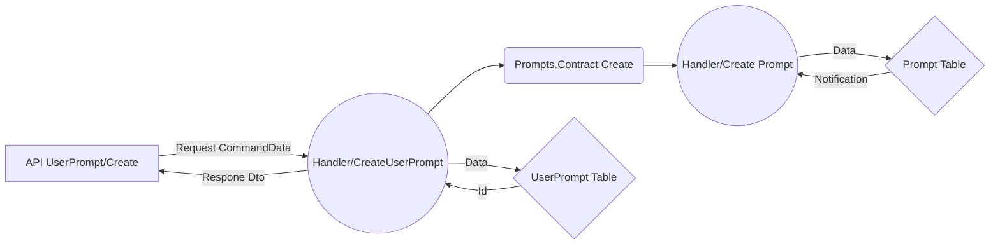

# Welcome to InPrompts as a Modular Monolith

### A cloud native architecture that's positioned to deploy as Microservices  

* **Domain Driven Design** - Entities with well defined root aggregates and separation.

* **Clean Architecture** - Domain/Application/Infrastructure with subcategory isolation.

* **Entity Framework Core 8** - Using fluent builder for more explicit context and migration.

* **Microsoft Identity** - Auth bearer implementation.

* **Docker** - Currently used to implement back end resources.

* **Postgres** - Containerized and part of our Dockerization.

* **Minimal Web API** - Using Fast-Endpoints with the _REPR_ (Request-Endpoint-Response) pattern.

* **MediatR** - Command query responsibility segregation _(CQRS)_ pattern with in-process debugging!

* **RabbitMQ** - Event bus for cross module complexities and aux functionality (email on publish)

* **Xunit** - TESTING, TESTING, TESING!

* **FluentAssestions** - Did I mention TESTING?

* **Angular 18** - Using all the latest features, see below;

# The Back End

InPrompts implements the latest design paradigms and architectural best practices from Microsoft. The Modular Monolith takes advantage of tenants that fall under "Pros" for both Microservices and Monoliths. While at the same time we do our best to leave the middle of the fray with as few "Cons" as possible. The added abstraction is the biggest thing we have to wrestle with, but it's substantially leaner than developing individual Microservices. 
I've become a huge fan of the Modular Monolith, it struck me profoundly due to it's capacity to solve the design paralysis that can come with starting a new project. The main factor that prevents individual developers and teams from achieving the holy grail of Microservice architecture is the startup. How often do we talk about refactoring, but the demands of the backlog keep the application moving in the same direction seemingly out of control?
The Modular Monolith positions developer so that we are well situated to refactor portions of the app into Microservice architecture with no tight coupling. We could, for example; Refactor our User entity and Identity module into its own Microservice to take on a large user ingress with horizontal deployment scaling on Azure. All, without having to overhaul or navigate too far from the the existing style and architecture of our application. A developer at any skill level becomes most capable of contributing deliverables, when they have adapted to the application.

Microsoft is no longer suggesting that we start at Microservice architecture, due to the cost and failure rate during engineering startup. Microsoft MVP's like Stever Smith, Ardalis now advocate the Modular Monolith as the starting architecture for .Net applications. The Modular Monolith by design fits well into the cloud ready era and frameworks like .Net Aspire. Cohesively this encourages developers to start building enterprise ready cloud native applications as the baseline for apps of any size.

I'd like to give credit to "Ardalis" for advocating best practices as one of Microsofts top MVP. This project uses two Nuget packages developed by him. It's unfortunate that but he has paywalled his material on Modular Monoliths... While we wait for official Microsoft Documentation, you can use this project as an example.

For More information on Modular Monoliths, see the following Microsoft productions;

[Visual Studio Live - Building a modular Monolith](https://www.youtube.com/watch?v=wkAc6K09pKQ&ab_channel=MicrosoftVisualStudio)

and

[.Net Live Modular Monoliths With Asp.Net](https://learn.microsoft.com/en-us/shows/on-net/on-dotnet-live-modular-monoliths-with-aspnet-core)

## API and command query pipeline

As part of our DDD principals, UserPrompts exists within the User domain. Following clean architecture principals, our UserPrompt API is a UseCase within the Application layer of our architecture. It falls within the UseCase category, because it also makes a call to the Prompt Entity which pulls us out of the Domain. If UserPrompts had no additional functionality but to create a UserPrompt, then we would keep that functionality at the Domain layer of the application, some would advocate that we abstract the call up to the Application layer with a passthrough.

For more information regarding best practices as advised by Microsoft, please visit;
[Microsoft .Net Conference 2023 Clean Architecture](https://www.youtube.com/watch?v=yF9SwL0p0Y0&t=1060s&ab_channel=dotnet) 

Please note, that this project follows clean architecture by logical structure. Domain/Infrastructure/Application are not separate applications/libs with cascading dependencies. I only recommend this level of abstraction if you break a module out into it's own Microservice or when you identify that complications in business logic are causing developers to break architectural conventions. No cheating! Keep the domains internal and communicate across domains via UseCase API Endpoints that call do the Domain.Contract. The DomainX.Contract act as are an interface to expose functionality of the domains.



## Prompts
Why is there a redundancy of Prompts and UserPrompts? Good question! The answer is that the redundancy will leverage incoming features to support my anticipated CCU of over a quadrillion users. On a more serious note, the landing page will be a `List<Prompt>` ranked by business logic and separated by category. With that in mind,  all incoming users will query the Prompts table. Users will interact with Prompts of their interest independently. Any Prompt where a user has content, will invoke sufficiently more interaction for that user than any other prompts, regardless of how those Prompts rank. To minimize round trips to the database, the user will carry a copy of their prompts as UserPrompts to make up for our compromised indexing strategy on rank and category. Additionally, the Prompts main page content will be paginated and cached with a key of datetime which will will only allow updates on at a time gated interval. The user can always view more content by consuming more content, e.g navigating further down the list.

# The Front End
Angular is on it's way to drop RXJS and ZoneJS . This will be the largest change the Angular ecosystem has seen in a long time. The most optimal route to get to Zoneless Angular, is by adopting Signals. Code style and boilerplate sees a massive change when we take on this adaptation, considering how prolific RXJS has been in throughout the lifetime of Angular. Taking advantage of Angular signals makes our code easier to implement, read, and debug while substantially reducing the size of our bundle. I strongly believe that staying congruent with Angular is in our best interest as .Net developers.

# Building And Running The App
The Web project is our startup application, it's a standard .Net Web API generated by the DotNet tool CLI. We also added a sln file via the CLI. All other applications are a class libs, pay close attention to the dependancies. I've compiled a list of strings in appsettings.json;

1. In the termal at the root of our app run docker compose up. This will build all the required back end services in docker.
2. We now need to run our Entity Framework Migrations for both our Entity Contexts. EfMigrationAddPrompts, EfMigrationAddUsers see the strings below;
3. Now update the database with the migrations. EfDatabasePrompts, EfDatabaseUsers see the strings below;
4. Run the application while pointing to our starting application. 

```
Step 1: Get our docker containers running;
docker compose up

Step 2: Migrating both Entities;
dotnet ef migrations add InitialPrompts -o Data/Migrations --context PromptsDbContext --project ./src/InPrompts.Prompts -s ./src/InPrompts.Web
dotnet ef migrations add InitialUsers -o Data/Migrations --context UsersDbContext --project ./src/InPrompts.Users -s ./src/InPrompts.Web

Step 3: Updating our DB
dotnet ef database update -s ./src/InPrompts.Web -p ./src/InPrompts.Prompts/ --context PromptsDbContext
dotnet ef database update -s ./src/InPrompts.Web -p ./src/InPrompts.Users/ --context UsersDbContext

Step 4: Run the application
dotnet watch run --project src/InPrompts.Web/