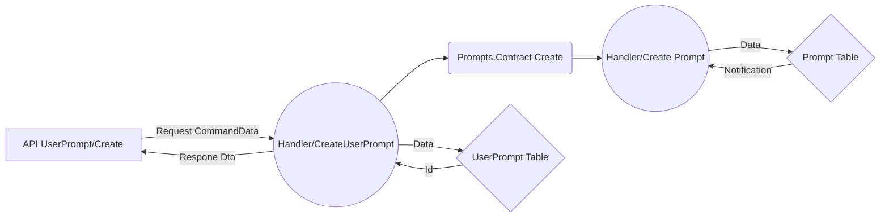

# Welcome to InPrompts as a Modular Monolith

### Tech stack

* Domain Driven Design - Entities with well defined root aggregates and separation.

* Clean Architecture - Domain/Application/Infrastructure with subcategory isolation.

* Entity Framework Core 8 - Using fluent builder for more explicit context and migration.

* Microsoft Identity - Auth bearer implementation.

* Docker - Currently used to implement back end resources.

* Postgres - Containerized and part of our Dockerization.

* Minimal Web API - Using Fast-Endpoints with the _REPR_ (Request-Endpoint-Response) pattern.

* MediatR - Command query responsibility segregation _(CQRS)_ pattern with in-process debugging!

* RabbitMQ - Event bus for cross module complexities and aux functionality (email on publish)

* Xunit - TESTING TESTING TESING

* FluentAssestions - Did I mention TESTING?

* Angular 18 - Angular is on it's way to drop RXJS and ZoneJS . This will be the largest change the Angular ecosystem, in a long time. We will drop two major project dependencies and increase Angular performance by a large margin. The most optimal route to get to Zoneless Angular, is by adopting Signals.

# The Back End

My application implements the latest design paradigms and architectural best practices from Microsoft. The modular monolith takes advantage of tenants that fall in the "Pros" section of both Microservices and Monoliths and leaves the fray with as few "Cons" as possible from developing an application that adheres to one exclusive architecture. I've become a huge fan of the Modular Monolith, it struck me profoundly due to it's capacity to solve the design paralysis that can come with starting a new project. The Modular Monolith positions developer so that we are well situated to refactor portions of the app into Microservice architecture with no tight coupling. We could, for example; Refactor our User entity and Identity module into its own Microservice to take on a large user ingress with horizontal deployment scaling on Azure, without having to overhaul or navigate too far from the the style and architecture of our application. A developer at any skill level becomes most capable when they have adapted to the application style, this is a good example of architecture that can onboard devs new to Microservices.

  

Microsoft is beginning to build out best practices/materials and are now recommending Modular Monolith as the starting architecture for .Net applications. The Modular Monolith by design fits well into the cloud ready era and frameworks like .Net Aspire. Cohesively this encourages developers to start building enterprise ready cloud native applications as the baseline for apps of any size.

Oh, I'd also like to shout out to Steve Smith "Ardalis" for advocating best practices as one of Microsofts top MVP for decades now. Two of his Nuget packages are used here "Ardalis.Result" and "Ardalis.GuardClauses". It's a shame that he has paywalled his information on Modular Monoliths while he advocates them at Microsoft. While we're waiting for the official "Microsoft Best Practices On Modular Monoliths" you can use this repo as a start!

For More information on Modular Monoliths, see the following Microsoft productions;

[Visual Studio Live - Building a modular Monolith](https://www.youtube.com/watch?v=wkAc6K09pKQ&ab_channel=MicrosoftVisualStudio)
[.Net Live Modular Monoliths With Asp.Net](https://learn.microsoft.com/en-us/shows/on-net/on-dotnet-live-modular-monoliths-with-aspnet-core)

## API and command query pipeline
CQRS Command Query Pipeline for our prompts is as follows.

As part of our DDD principals, UserPrompts exists within the User domain. Following clean architecture principals, our UserPrompt API is a UseCase within the Application layer of our architecture. It falls within the UseCase category, because makes a call to the Prompt Entity as well. If UserPrompts had no additional functionality but to create a UserPrompt, then we would keep that functionality at the Domain layer of the application, some would advocate that we abstract the call up to the Application layer with a passthrough.

For more information regarding best practices as advised by Microsoft, please visit;
[Microsoft .Net Conference 2023 Clean Architecture](https://www.youtube.com/watch?v=yF9SwL0p0Y0&t=1060s&ab_channel=dotnet) 

Please note, that the Modular Monolith follows clean architecture by logical structure. Domain/Infrastructure/Application are not separate applications/libs with cascading dependencies. I only reccomend this level of abstraction if you break a module out into it's own Microservice or when you identify complications in business logic are causing developers to break architectural conventions. No cheating! Keep the domains internal and communicate across domains via UseCase API Endpoints that call do the Domain.Contract. The DomainX.Contract act as are an interface to expose functionality of the domains.

## Prompts
Why is there a redundancy in Prompts and UserPrompts? Good question, and the answer is that the redundancy will leverage incoming features to support my anticipated CCU of over a quadrillion users. On a more serious note, ideally the landing page will be a `List<Prompt>` ranked by business logic and separated by category. With that in mind,  all incoming users will query the Prompts table. Users will interact with Prompts of their interest independently. Any Prompt where a user has content, will invoke sufficiently more interaction for that user than any other prompts, regardless of how those Prompts rank. To minimize round trips to the database, the user will carry a copy of their prompts as UserPrompts to make up for our compromised indexing strategy on rank and category. Additionally, the Prompts main page content will be paginated and cached with a key of datetime which will will only allow updates on at a time gated interval. The user can always view more content by consuming more content, e.g navigating further down the list.