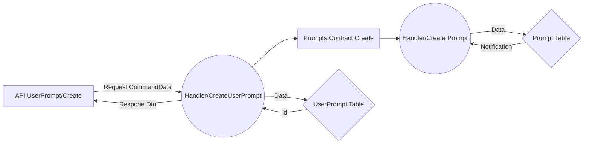

  # Welcome to InPrompts as a Modular Monolith

### Overview
InPrompts is a cloud-native application designed using the modular monolith architecture. The latest Microsoft recommendation in architecture, that allows for easy deployment as microservices in the future. This approach combines the best of both monolithic and microservice architectures, providing a scalable and maintainable solution.

*Note, I am contributing to this repo on the daily. Please feel free to reach out with questions, thoughts, etc.

*  **Domain Driven Design** - Well-defined root aggregates and domain separation

*  **Clean Architecture** - Structured into Domain, Application, and Infrastructure application layers
 
*  **Entity Framework Core 8** - Using fluent builder for more explicit context and migration

*  **.Net 8** - Quality of life enhancements, such as primary constructor dependency injection, reduce boilerplate and write cleaner code
 
*  **Microsoft Identity** - Authentication with bearer token implementation
 
*  **Docker** - Containerization of backend resources
 
*  **Postgres** - Stores all our entities that are root aggregates following DDD. We is also use Postgres in conjunction with RabbitMQ/MassTransit to implement the Saga design pattern
 
* **MongoDB** - A background service checks the MongoDB instance to send out emails
 
*  **Minimal Web API** - Utilizing Fast-Endpoints with the _REPR_ (Request-Endpoint-Response) pattern, ditch those old controllers!
 
*  **MediatR** - Implementing Command Query Responsibility segregation _(CQRS)_ pattern with in-process debugging
 
*  **Xunit** - TESTING, TESTING, TESING!
 
*  **FluentAssestions** - Did I mention TESTING?
 
*  **Angular 18** - Frontend implementation with the all the latest Angular features; designed to be a zoneless Angular application
 
*  **RabbitMQ/Mass Transit** - Event bus for cross-module communication and auxiliary functionality *Please see event bus section below
  

# The Back End
InPrompts implements the latest design paradigms and architectural best practices promoted by Microsoft. The Modular Monolith takes advantage of tenants that fall under "Pros" for both Microservices and Monoliths. At the same time we do our best to leave the middle of the fray with as few "Cons" as possible. All the infrastructure, resources, and added abstraction can be so cumbersome that we end in a position where Microservice and horizontal scaling is not an option. Let's start off our projects on the right foot!

I've become a huge fan of the Modular Monolith, it struck me profoundly due to it's capacity to solve the design paralysis that can come with starting a new project. A primary factor which prevents individual developers and teams alike, from achieving the holy grail of Microservice architecture is the startup. How often do we consider or suggest refactoring as developers, but the demands of the backlog keep the application moving in the same direction, seemingly out of control?

The Modular Monolith positions developers so that we are well situated to refactor portions of the app into Microservice architecture. Essentially we start building our application as microservice modules, with no tight coupling, under one solution. We could, for example; Refactor our User entity / Identity module into its own Microservice to take on a large user ingress with a horizontal deployment scaling strategy on Azure. All, without having to overhaul or navigate too far from the the existing style and architecture of our application.

The agnostic design lends itself as a boon to any development team. A developer regardless of their skill level is most capable of contributing deliverables, when they understand the design of the application.

Microsoft is now encouraging developers steer clear of Microservice architecture at the start of a project. This is due to the costs and failure rates that happen during the start of a project. Microsoft and MS MVP's now advocate the Modular Monolith as the starting architecture for .Net applications. The Modular Monolith fits well into a cloud ready era. The direction Microsoft is heading for production level applications is apparent new frameworks like .Net Aspire. We are encouraged to start building enterprise ready, scaling, cloud native applications as the baseline for projects of any size.

I'd like thank Ardalis for advocating best practices as one of Microsofts top MVP. This project uses two of his Nuget packages. Unfortunatly he has paywalled material on Modular Monoliths... In the meantime, while we wait for official Microsoft documentation, I hope this project you a solid example

For More information on Modular Monoliths, see the following Microsoft productions;

[Visual Studio Live - Building a modular Monolith](https://www.youtube.com/watch?v=wkAc6K09pKQ&ab_channel=MicrosoftVisualStudio)

and

[.Net Live Modular Monoliths With Asp.Net](https://learn.microsoft.com/en-us/shows/on-net/on-dotnet-live-modular-monoliths-with-aspnet-core)

## API and command query pipeline
As part of our DDD principals, UserPrompts exists within the User domain. Following clean architecture principals, our UserPrompt API is a UseCase within the Application layer of our architecture. It falls within the UseCase category, because it also makes a call to the Prompt Entity which pulls us out of the Domain. If UserPrompts had no additional functionality but to create a UserPrompt, then we would keep that functionality at the Domain layer of the application, some would advocate that we abstract the call up to the Application layer with a passthrough.

For more information regarding best practices as advised by Microsoft, please visit;

[Microsoft .Net Conference 2023 Clean Architecture](https://www.youtube.com/watch?v=yF9SwL0p0Y0&t=1060s&ab_channel=dotnet)

Please note, that this project follows clean architecture by logical structure. Domain/Infrastructure/Application are not separate applications/classlibs with cascading dependencies. I only recommend this level of abstraction if you pull out a module out into it's own Microservice appllication or when you identify that complications in business logic are causing developers to break architectural conventions. No cheating! Keep the domains internal and communicate across domains via UseCase API Endpoints that call do the Domain.Contract. The DomainX.Contract act as are an interface to expose functionality of the domains.


# Prompts
Why is there a redundancy of Prompts and UserPrompts? Good question! The answer is that the redundancy will leverage incoming features to support my anticipated CCU of over a quadrillion users. On a more serious note, the landing page will be a `List<Prompt>` ranked by business logic, and prompts are separated by category.

Any Prompt where a user has content, will invoke sufficiently more interaction for that user than other prompts, regardless of how those Prompts rank. To minimize round trips to the database, the user will carry a copy of their prompts as UserPrompts to make up for our compromised indexing strategy. Additionally, the Prompts main page content will be paginated and cached with a key of datetime which will will only allow updates on at a time gated interval. The user can always view more content by consuming more content, e.g navigating further down the list.

# EventBus - RabbitMQ/Mass Transit
I want to clarify that our event bus, in the current context, is a contrived example. Given our architecture and current size and complexity, the implementation is unnecessary because our modules communicate across the x.Contract application layer via MediatR and registered assemblies using CQRS. We only want to  run the expense of multiple applications and provisioning the additional hardware if this were a real product with high user ingress.
This implementation shows how we would navigate refactoring features, or transition to full microservice architecture. To achieve this, we want to continue with our current implementation leveraging the Event Bus. The EventBus module, contains our configurations for RabbitMQ, MassTransit, and project solutions that negotiate communication between modules
With that said, RabbitMQ is provisioned as part of our docker resoruces and is serving an EventBus using MassTransit Saga.

# The Front End - Pending Implementation
Angular is on it's way to drop RXJS and ZoneJS . This will be the largest change the Angular ecosystem has seen in a long time. The most optimal route to get to Zoneless Angular, is by adopting Signals. Code style and boilerplate sees a massive change when we take on this adaptation, considering how prolific RXJS has been in throughout the lifetime of Angular. Taking advantage of Angular signals makes our code easier to implement, read, and debug while substantially reducing the size of our bundle. I strongly believe that staying congruent with Angular is in our best interest as .Net developers.

# Building And Running The App
The Web project is our startup application, it's a standard .Net Web API generated by the DotNet tool CLI. We also added a sln file via the CLI. All other applications are a class libs, pay close attention to the dependancies. I've compiled a list of strings in appsettings.json;
1. In the termal at the root of our app run docker compose up. This will build all the required back end services in docker.

2. We now need to run our Entity Framework Migrations for both our Entity Contexts. EfMigrationAddPrompts, EfMigrationAddUsers see the strings below;

3. Now update the database with the migrations. EfDatabasePrompts, EfDatabaseUsers see the strings below;

4. Run the application while pointing to our starting application.
```
Step 1: Get our docker containers running;

docker compose up

-------------------------------------------------------------------
Step 2: Migrating both Entities;

dotnet ef migrations add InitialPrompts -o Infrastructure/Data/Migrations --context PromptsDbContext --project ./src/InPrompts.Prompts -s ./src/InPrompts.Web

dotnet ef migrations add InitialUsers -o Infrastructure/Data/Migrations --context UsersDbContext --project ./src/InPrompts.Users -s ./src/InPrompts.Web

dotnet ef migrations add InitialEventBus -o Infrastructure/Data/Migrations --context SagaDbContext --project ./src/InPrompts.EventBus -s ./src/InPrompts.Web

-------------------------------------------------------------------

Step 3: Updating our DB

dotnet ef database update -s ./src/InPrompts.Web -p ./src/InPrompts.Prompts/ --context PromptsDbContext

dotnet ef database update -s ./src/InPrompts.Web -p ./src/InPrompts.Users/ --context UsersDbContext

dotnet ef database update -s ./src/InPrompts.Web -p ./src/InPrompts.EventBus/ --context SagaDbContext

-------------------------------------------------------------------
Step 4: Run the application

dotnet watch run --project src/InPrompts.Web/